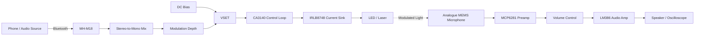

<div align="center">

# Light Modulator + MEMS Mic Amp

**A compact two-board hardware platform for experimenting with optical audio modulation and MEMS microphone response.**

[](#)
[](https://www.kicad.org/)
[](#project-status)
[](#license)

**Bluetooth audio → current-modulated LED/laser → MEMS microphone → audio amplifier**

</div>

> [!WARNING]
> **Laser safety:** This project can drive visible and near-infrared laser diodes. Near-IR beams may be difficult or impossible to see. Use the lowest practical optical power, a proper beam stop/enclosure, appropriate eye protection, and never aim a beam at people or reflective surfaces.

## Overview

This project is an experimental hardware platform for studying **optical audio injection into analogue microphones**.

It consists of two PCBs:

| Transmitter | Receiver |
|---|---|
| Receives audio over Bluetooth | Supports multiple analogue microphone types |
| Mixes stereo audio to mono | Low-noise microphone preamplifier |
| Adds adjustable DC bias and modulation depth | Speaker/audio output stage |
| Drives an LED or laser with an analogue current waveform | Allows microphone-to-microphone comparison |
| Uses a closed-loop current sink | Can be monitored with an oscilloscope |

The transmitter has already been **bench-tested and is functional**. Receiver validation is ongoing.

## System Architecture



## Transmitter

The transmitter converts Bluetooth audio into a controlled LED or laser current.

```text
Phone
  ↓ Bluetooth
MH-M18
  ↓
L/R audio mixed to mono
  ↓
Modulation-depth control
  ↓
DC bias + audio = VSET
  ↓
CA3140
  ↓
IRLB8748 current sink
  ↓
LED / laser diode
```

The CA3140 compares the requested control voltage (`VSET`) with the voltage across the current-sense resistor and drives the IRLB8748 until they match.

The approximate optical-source current is:

$$
I_{LED} \approx \frac{V_{SET}}{R_{SENSE}}
$$

This causes the LED or laser brightness to follow the audio waveform while maintaining an adjustable DC operating point.

### Main Transmitter Components

| Component | Function |
|---|---|
| **MH-M18** | Bluetooth audio receiver |
| **CA3140** | Current-control error amplifier |
| **IRLB8748** | Power MOSFET / controlled current sink |
| **LM7805** | 5 V supply for Bluetooth module |
| **RV2** | DC bias / optical operating point |
| **RV3** | Audio modulation depth |
| **R<sub>SENSE</sub>** | Sets the current range |

<details>
<summary><strong>Current-limit examples</strong></summary>

With the present bias network, the maximum DC `VSET` is approximately **0.82 V**.

| R<sub>SENSE</sub> | Approx. maximum DC current |
|---:|---:|
| 120 Ω | 6.8 mA |
| 22 Ω | 37 mA |
| 16.2 Ω | 51 mA |
| 4.3 Ω | 190 mA |

The resistor must be selected for the specific LED or laser being tested.

Audio modulation can create instantaneous current peaks above the DC operating point.

</details>

## Receiver

The receiver is designed to make the microphone response easy to hear and measure.

```text
Analogue microphone
  ↓
AC coupling
  ↓
MCP6281 preamplifier
  ↓
Volume control
  ↓
LM386 audio amplifier
  ↓
8 Ω speaker / oscilloscope
```

### Microphone Options

The receiver platform is intended for comparison between different analogue microphone technologies, including:

- **Infineon IM68A130** analogue MEMS microphone
- **TDK InvenSense ICS-40300** analogue MEMS microphone
- **ADMP401 breakout module** as a reference microphone
- Conventional electret microphone for control measurements

The onboard MCP6281 stage provides approximately **×48 voltage gain** for low-level microphone signals.

The LM386 provides the final power amplification for an 8 Ω speaker.

> [!NOTE]
> The ADMP401 breakout includes its own amplification, so it should be evaluated separately before feeding it through the full onboard microphone gain stage.

## Prototype

The first assembled transmitter and receiver prototypes are shown below.

<p align="center">
  
</p>

## Quick Start

1. **Choose the optical source.** Start with an LED before moving to a laser diode.
2. **Set the current range.** Select `R_SENSE` for the required current before connecting the optical device.
3. **Power the transmitter.** Verify the supply rails before fitting the LED or laser.
4. **Connect Bluetooth audio.** Pair a phone with the MH-M18 and play a low-volume test signal.
5. **Set the DC bias.** Increase the optical operating point gradually.
6. **Add modulation.** Increase the modulation-depth control while observing the output on an oscilloscope if available.
7. **Test the receiver.** Aim the modulated light at the microphone and monitor the recovered signal through the speaker or oscilloscope.

## Project Goals

This project is intended as a practical experimental platform for:

- reproducing and exploring optical-to-electrical coupling in analogue MEMS microphones;
- comparing microphone responses across different devices and optical wavelengths;
- testing different modulation depths, bias currents and optical sources;
- providing an inexpensive alternative to laboratory-only modulation hardware;
- making the phenomenon easy to demonstrate and measure on the bench.

## Project Status

| Subsystem | Status |
|---|---|
| Bluetooth audio input | ✅ Bench tested |
| Audio mixing / modulation | ✅ Bench tested |
| CA3140 + IRLB8748 current control | ✅ Bench tested |
| LED modulation | ✅ Bench tested |
| Laser-diode operation | 🧪 Device-dependent testing |
| MEMS receiver PCB | 🧪 Prototype / validation |
| Multi-microphone comparison | 🔬 Planned testing |

## Background

This project is inspired by the research presented in:

**T. Sugawara, B. Cyr, S. Rampazzi, D. Genkin and K. Fu,  
“Light Commands: Laser-Based Audio Injection Attacks on Voice-Controllable Systems,”  
29th USENIX Security Symposium, 2020.**

- [USENIX paper and presentation](https://www.usenix.org/conference/usenixsecurity20/presentation/sugawara)
- [Light Commands project website](https://lightcommands.com/)

The original research demonstrated that amplitude-modulated light can induce electrical signals in MEMS microphones.

This repository is an **independent experimental hardware implementation** intended for controlled research and educational testing.

## Safety and Responsible Use

This repository is intended for **laboratory, educational and defensive research**.

Do not direct lasers at people, vehicles, cameras, public devices or equipment you do not own or have explicit permission to test.

Use appropriate laser controls for the wavelength and optical power being used.

Infrared laser sources deserve particular care because the beam may not be visible.

## Contributing

Suggestions, measurements, microphone comparisons and hardware improvements are welcome.

For substantial changes, please open an issue first so the proposed change can be discussed before a pull request is prepared.

Useful contributions include:

- measurements from additional analogue MEMS microphones;
- optical wavelength comparisons;
- PCB and layout improvements;
- current-control stability measurements;
- oscilloscope captures and frequency-response data;
- documentation corrections.

## License

Copyright © 2026 Taylan Arslan.

This project is available for **research, educational, academic, personal, and other non-commercial use** under the terms of the [`LICENSE.md`](LICENSE.md) file.

**Commercial use is not permitted under the public license.**

Commercial manufacture, integration into a commercial product or service, internal commercial R&D, resale, or other commercial exploitation requires a **separate commercial license from the author**.

Commercial licenses may be provided for a fee. For commercial licensing enquiries, please contact **Taylan Arslan**.

The project is provided **as-is, without warranty**. Users are responsible for verifying the design, selecting appropriate components, complying with applicable regulations, and following electrical and laser-safety requirements.

See [`LICENSE.md`](LICENSE.md) for the complete terms.
## Author

**Taylan Arslan**

GitHub: [@manyetox](https://github.com/manyetox)

---

<div align="center">

### Light in. Audio out.

If this project helps your research, consider starring the repository.

</div>
