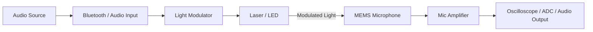
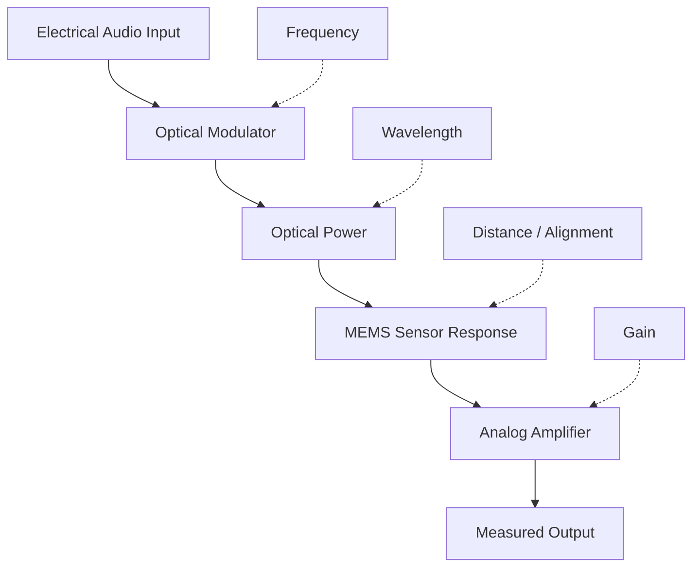

# Light Modulator + MEMS Mic Amplifier

> Compact hardware for controlled optical-audio experiments using a modulated laser/LED source and an amplified MEMS microphone.

**Status:** Prototype / active development  
**Designed in:** KiCad  
**Focus:** Optical modulation • MEMS microphones • Analog electronics • Hardware experimentation

---

## Overview

This repository contains the PCB designs for two complementary experimental boards:

| Board | Function |
|---|---|
| **Light Modulator** | Converts an audio signal into intensity modulation of a laser diode or LED |
| **MEMS Mic Amplifier** | Powers a MEMS microphone and amplifies its analog output for measurement |

Together, the boards form a compact experimental platform for studying the response of MEMS microphones to modulated optical signals.

The project was developed primarily for controlled laboratory experiments and hardware characterization.

---

## How It Works



The transmitter varies the optical emitter intensity according to the incoming audio waveform.

The modulated light is directed toward a MEMS microphone under test. Any resulting electrical response is amplified by the receiver board and can then be observed using an oscilloscope, ADC, audio interface, or other measurement equipment.

---

## Hardware

### Light Modulator

The light-modulator PCB is designed to provide a compact optical transmitter for experimentation.

**Main functions:**

- Bluetooth/audio input
- Analog audio conditioning
- Current-controlled laser/LED modulation
- Replaceable optical emitter
- Adjustable operating point
- Accessible test points for measurement and debugging

The circuit is intended to reproduce the audio waveform as an optical-intensity modulation rather than simply switching the emitter on and off.

### MEMS Microphone Amplifier

The second PCB provides the microphone-side analog electronics.

**Main functions:**

- MEMS microphone interface
- Microphone bias/power
- Low-noise analog amplification
- Signal conditioning
- Accessible analog output for measurement

This allows very small microphone signals to be observed directly with laboratory equipment.

---

## Experimental Setup

A typical bench setup looks like:

```text
                    OPTICAL PATH
             ───────────────────────►

 Audio                Laser / LED              MEMS Mic
 Source                    │                       │
   │                        │                       │
   ▼                        ▼                       ▼
┌────────┐             ┌─────────┐            ┌─────────┐
│ Light  │────────────►│ Optical │───────────►│ Mic PCB │
│Modulator│            │ Emitter │            │ + Amp   │
└────────┘             └─────────┘            └────┬────┘
                                                   │
                                                   ▼
                                             Oscilloscope
```

Useful variables to characterize include:

| Variable | Example measurement |
|---|---|
| Audio frequency | Frequency response |
| Optical power | Microphone output amplitude |
| Emitter wavelength | Optical sensitivity |
| Distance | Received signal vs. range |
| Alignment | Sensitivity to beam position |
| Modulation depth | Linearity |
| Amplifier gain | Signal-to-noise ratio |
| Microphone model | Device-to-device response |

---

## Getting Started

1. Download or clone the repository.
2. Open the KiCad project files.
3. Review the schematic and PCB revision before manufacturing.
4. Check the BOM against the revision you are building.
5. Assemble and inspect the PCB.
6. Power the board from a **current-limited bench supply** for first bring-up.
7. Verify all supply rails before installing the optical emitter or microphone.
8. Test the transmitter with an **LED first** before moving to a laser diode.
9. Observe the modulated output using an oscilloscope.
10. Connect the MEMS microphone board and begin characterization.

<details>
<summary><strong>Recommended first power-up procedure</strong></summary>

<br>

Before connecting an optical emitter:

- Inspect for shorts between power and ground.
- Use a current-limited laboratory supply.
- Verify each regulator output.
- Check DC bias points around the analog stages.
- Feed a low-amplitude sine wave into the audio input.
- Observe the driver output with an oscilloscope.
- Start with an inexpensive LED.
- Only install the intended laser diode after the modulation circuit has been verified.

</details>

---

## Design Goals

The hardware is being developed around a few simple principles:

- **Compact** — small enough to integrate easily into optical experiments.
- **Low cost** — built primarily from readily obtainable components.
- **Modular** — optical emitters and microphones can be changed between experiments.
- **Measurable** — important internal signals are accessible for debugging.
- **Reproducible** — PCB files and experimental parameters can be documented together.
- **Hackable** — the design is intended to evolve as measurements reveal what matters.

---

## What I Want to Measure

Rather than treating the system as a black box, the goal is to characterize the full signal chain:



Interesting measurements include:

- frequency-response curves,
- optical-power versus received-signal amplitude,
- wavelength dependence,
- distortion and harmonic content,
- maximum usable modulation bandwidth,
- signal-to-noise ratio,
- microphone-to-microphone variation,
- beam-position sensitivity,
- and the effect of distance and optical alignment.

---

## Project Status

This project is currently in the **prototype and characterization stage**.

PCB revisions may change as hardware is assembled and tested.

### Current

- [x] Initial circuit design
- [x] PCB development
- [x] Optical-modulator prototype
- [x] MEMS microphone amplifier prototype
- [ ] Full electrical characterization
- [ ] Frequency-response measurements
- [ ] Optical wavelength comparison
- [ ] Documented oscilloscope results
- [ ] Final optimized PCB revision

---

## Results

Experimental plots, oscilloscope captures, PCB photographs, and test results will be added here as the project develops.

> **Tip:** If you are browsing this project later, check the repository history for the PCB revision associated with each measurement.

<!--
Suggested future images:

docs/images/modulator-pcb.jpg
docs/images/memsmic-pcb.jpg
docs/images/test-setup.jpg
docs/images/oscilloscope-result.png
-->

---

## Background

This project is related to research demonstrating that amplitude-modulated light can produce electrical responses in certain MEMS microphones.

A major reference for the experiment is:

**T. Sugawara, B. Cyr, S. Rampazzi, D. Genkin and K. Fu,  
“Light Commands: Laser-Based Audio Injection Attacks on Voice-Controllable Systems,”  
29th USENIX Security Symposium, 2020.**

The hardware in this repository is intended for controlled experimental study of the underlying phenomenon.

---

## Safety

> [!CAUTION]
> **Lasers can cause permanent eye injury.**

Always verify the wavelength, optical power, and safe operating current of the emitter before use.

- Do not point a laser toward people or animals.
- Do not view a laser beam directly or through optical instruments.
- Use an enclosed optical path whenever practical.
- Use appropriate laser safety equipment for the wavelength and power being tested.
- Disable the emitter while adjusting the mechanical setup whenever possible.
- Start initial circuit testing with an LED instead of a laser.
- Do not exceed the rated current of the optical emitter.

This project should only be used on equipment you own or have explicit permission to test.

---

## Contributing

Measurements and hardware improvements are welcome.

If you reproduce the experiment or modify the PCB, useful information to include is:

- PCB revision
- microphone model
- emitter type and wavelength
- emitter current
- optical distance
- modulation frequency
- amplifier gain
- oscilloscope captures
- unexpected behaviour or failures

Detailed measurements are particularly valuable because they make comparisons between different hardware revisions possible.

---

## Repository Roadmap

Future revisions may explore:

- smaller PCB layouts,
- alternative optical drivers,
- different laser/LED wavelengths,
- improved analog noise performance,
- additional test points,
- configurable amplifier gain,
- automated frequency sweeps,
- and systematic characterization of different MEMS microphones.

---

## Disclaimer

This is experimental hardware and is provided for research and educational use.

PCB files should be reviewed before manufacturing. Component values, footprints, operating limits, and laser safety requirements should be independently verified before use.
